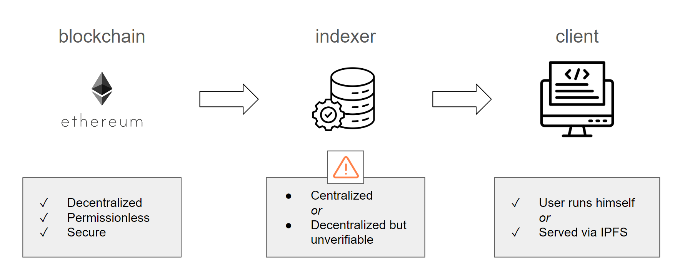
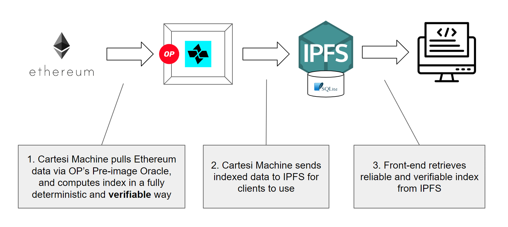

# ETHDenver 2024 - VeriFido


VeriFido is an ETHDenver 2024 hackathon project that produces **verifiable Ethereum indexing**.

Its end game is to allow something like TheGraph to execute in a deterministic, decentralized, and verifiable environment. This way, its resulting indexing data can be disputable on-chain!

To make that possible, this project leverages the [Cartesi Machine](https://docs.cartesi.io/cartesi-machine/) and [Optimism's Pre-image Oracle](https://blog.oplabs.co/composable-pre-image-oracle/).

## Why verifiable indexing?

At the time of writing, this is the basic workflow of most Ethereum-based applications:



As displayed above, the status quo for indexer services is that they are either centralized or decentralized but unverifiable. This means that, although reasonably secure, these services still need to rely on human intervention for arbitrating any misbehavior.

While this does not represent a direct risk to user assets, it does leave a door open for tricking users into taking bad decisions by showing them false information.

## VeriFido architecture

In VeriFido, the indexer service is made verifiable and disputable by leveraging two important technologies.

First, the [Cartesi Machine](https://docs.cartesi.io/cartesi-machine/) provides a deterministic and verifiable execution environment, which can be used to run the general indexing processing.
Moreover, since we can run a full Linux OS with the Cartesi Machine, VeriFido indexing jobs can be coded to leverage mainstream technologies such as Postgres or SQLite databases to store the indexed data.

Besides the processing itself, the other critical part of the indexing workflow is to fetch data from the blockchain in a verifiable way. To make that possible, VeriFido uses [Optimism's Pre-image Oracle](https://blog.oplabs.co/composable-pre-image-oracle/) to fetch block data based on keccak256 hashes.
As such, when Cartesi's upcoming [Dave](https://cartesi.io/blog/grokking-dave/) fraud-proof protocol is operational, the entire indexing procedure will become permissionlessly disputable on-chain.

Finally, the structured indexed data is posted to IPFS to allow any client to query it. In VeriFido, this data is currently posted as an SQLite database, which can then be queried remotely by a front-end clients such as web apps.

The diagram below illustrates VeriFido's full architecture:



## Components

### [dehashing-server](./dehashing-server/)

A server that connects to a slightly modified Optimism node instance (linked to this project as a [submodule](./optimism/)) in order to use its Pre-image Oracle to fetch block data given keccak256 hashes.

### [frontend](./frontend/)

A frontend that uses indexed data from the [gravity](./gravity/) example indexing job.

### [gravity](./gravity/)

An example indexer, which processes events emitted by a [Gravatar](./gravity-contracts/) contract that stores user gravatar profiles.

### [gravity-contracts](./gravity-contracts/)

A smart contract allowing users to store and update their gravatar profile.
It was extracted from a [subgraph example from TheGraph](https://github.com/graphprotocol/example-subgraph).

### [log-iterator](./log-iterator/)

A JSON-RPC server that runs inside the Cartesi Machine and connects to the machine's I/O device to query block data via keccak256 hashes.
This server can be used by the application code (in this case, the [gravity](./gravity/) indexer) to fetch blockchain data.

In practice, the supervisor code running the machine will route these requests to an instance of the [dehashing-server](./dehashing-server/). In other words, the node running the Cartesi Machine also needs to run a [dehashing-server](./dehashing-server/) in order to handle block data requests.

### [log-iterator-js](./log-iterator-js/)

A partially implemented experimentation of [log-iterator](./log-iterator/) functionality written in Typescript/Javascript instead of Go.

## Demo

[](https://www.youtube.com/watch?v=aWEkcefeOzA)

## Running the indexer

Start the Cartesi Lambada devkit.

- For amd64 systems, execute:

```shell
docker run -e KECCAK256_SOURCE=http://web3.link:8000 -p 8081:8081 -p 3033:3033 --privileged -it zippiehq/lambada-ethdenver-devkit-amd64:1.1
```

- For arm64 systems, execute:

```shell
docker run -e KECCAK256_SOURCE=http://web3.link:8000 -p 8081:8081 -p 3033:3033 --privileged -it zippiehq/lambada-ethdenver-devkit-arm64:1.1
```

**Note**: this uses a remotely deployed instance of the [dehashing-server](./dehashing-server/). You may also follow [these instructions](#advanced-directly-running-and-querying-the-dehashing-server) to build and run the server locally. In that case, change `KECCAK256_SOURCE` to point to http://localhost:8000.

Wait until it is up and running, after which it will print something like this:

```
===============================================================================
Now you can access the Cartesi development environment on http://localhost:8081

or

docker exec -it <container-id> /bin/bash
===============================================================================
```

Follow one of the two options to open a terminal within the devkit environment.

```shell
docker exec -it <container-id> /bin/bash
```

Once inside, clone this repo and `cd` into it:

```shell
git clone https://github.com/stskeeps/ethdenver2024
cd ethdenver2024
```

Then, build the application and start it up:

```shell
cartesi-build
```

This will take some time, after which it will print the following info:

```
Done! Chain CID is <cid>

You can now make your Lambada node:
- subscribe to your chain with: curl http://127.0.0.1:3033/subscribe/<cid>
- send a transaction to your chain: curl -X POST -d 'transaction data' -H "Content-type: application/octet-stream" http://127.0.0.1:3033/submit/<cid>
- read latest state CID: curl http://127.0.0.1:3033/latest/<cid>
```

To ask the application to update the Gravatar index, first subscribe and then submit arbitrary data to it by calling the `submit` endpoint as described above.

You may find application logs in `/tmp/cartesi-machine.logs`.

## Directly running and querying the dehashing server

### Cloning submodules

Make sure the appropriate optimism fork is cloned as a submodule:

```shell
git submodule update --init
```

### Build Optimism fork

```shell
docker build -t opstack:cartesi -f ./optimism/ops/docker/op-stack-go/Dockerfile ./optimism
```

### Build and run dehashing server

```shell
docker build ./dehashing-server -t dehashing-server
docker run -p 8000:8000 -e ALCHEMY_RPC_URL=<alchemy-rpc-url> -e HEAD_BLOCK_HASH=<head-block-hash> dehashing-server
```

Replace `<alchemy-rpc-url>` with a Sepolia Alchemy RPC URL.
Replace `<head-block-hash>` wtih L1 head block hash.

### Query block hash

The following queries for block `6e4dd5b03a4fa7b85be4d6bd78bf641cf2fd1de92c8eb9b673c14edd349258d5` from sepolia.

```shell
curl "http://localhost:8000/hint/l1-block-header%200x6e4dd5b03a4fa7b85be4d6bd78bf641cf2fd1de92c8eb9b673c14edd349258d5"
curl "http://localhost:8000/dehash/6e4dd5b03a4fa7b85be4d6bd78bf641cf2fd1de92c8eb9b673c14edd349258d5" | xxd
```
